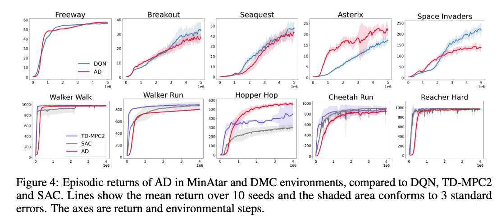
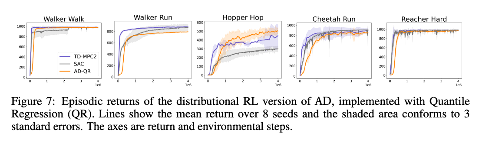
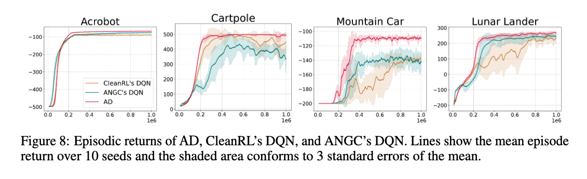

# Temporal-Difference Learning Using Distributed Error Signals [[paper](paperURL)]

Jonas Guan, Shon Eduard Verch, Claas Voelcker, Ethan C. Jackson, Nicolas Papernot, William A. Cunningham

## Abstract

A computational problem in biological reward-based learning is how credit assignment is performed in the nucleus accumbens (NAc) to update synaptic weights. Much research suggests that NAc dopamine encodes temporal-difference (TD) errors for learning value predictions. However, dopamine is synchronously distributed in regionally homogeneous concentrations, which does not support explicit credit assignment (like used by backpropagation). It is unclear whether distributed errors alone are sufficient for synapses to make coordinated updates to learn complex, nonlinear reward-based learning tasks. We design a new deep Q-learning algorithm, Artificial Dopamine, to computationally demonstrate that synchronously distributed, per-layer TD errors may be sufficient to learn surprisingly complex RL tasks. We empirically evaluate our algorithm on MinAtar, the DeepMind Control Suite, and classic control tasks, and show it often achieves comparable performance to deep RL algorithms that use backpropagation.

## Usage

### Environment Setup

Install the Poetry package manager and then run `poetry install` in the root directory of this repository. By default, JAX and PyTorch will be installed with CPU only support. To install GPU support, run `poetry add jax --extras "cuda11"` manually. You'll need to change the CUDA version to match your system if you're using a different version.

If using Visual Studio Code, we recommend installing the Python extension and setting the Python interpreter to the one managed by Poetry (which can be found by running `poetry env info` in the terminal).

### Running an Experiment

We provide a minimal training script in `scripts/train.py`. For example, to train an AD-DQN model on the `CartPole-v1 environment`, run:

```bash
poetry run python scripts/train.py CartPole-v1 ad_dqn
```

This script supports training a model with the standard AD-DQN algorithm and AD-QRDQN, its quantile regression variant.

We use Weights and Biases (WandB) to log results, so you'll need to sign up for an account and run `poetry run wandb login` to authenticate. Once you've done that, you can view the results on the WandB dashboard by running `poetry run wandb ui` or by visiting the project page in your browser. Results are logged locally in the `runs` directory.

See the script for more details, including how to change hyperparameters.

## Results

We empirically evaluate our algorithm on MinAtar, the DeepMind Control Suite, and classic control tasks, and show it often achieves comparable performance to deep RL algorithms that use backpropagation. The figures below show the results of our experiments on MinAtar tasks, the DeepMind Control Suite, and Gymnasium classic control tasks. See our [paper](paperURL) for more details.

### MinAtar & DeepMind Control Suite
<p align="center">
  
</p>
<p align="center">
  
</p>

### Classic Control Tasks
<p align="center">
  
</p>


## Citation

If you find our work useful or relevant to your research, please kindly cite our paper:

```bibtex
@article{guan2024temporal,
    title={Temporal-Difference Learning Using Distributed Error Signals},
    author={Guan, Jonas and Verch, Shon and Voelcker, Claas A and Jackson, Ethan C and Papernot, Nicolas and Cunningham, William},
    journal={Advances in Neural Information Processing Systems},
    volume={38},
    year={2024},
    url={paperURL}
}
```
